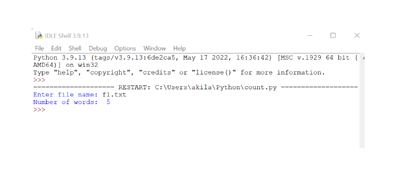

# Word-count
## AIM:
To write a python program for getting the word count from a text.
## EQUIPEMENT'S REQUIRED: 
PC
Anaconda - Python 3.7
## ALGORITHM: 
### Step 1:
Recieve the input file name.

### Step 2: 
Declare count variable as zero.
 
### Step 3: 
Read the input file.

### Step 4: 
Count words through the line. 

### Step 5: 
Add it to count variable.

### Step 6: 
Print the result.

## PROGRAM:
```python
'''
Developed by: Vishnupriya R
Reference number: 22006962
'''
fname=input('Enter file name: ')
num_words=0
with open(fname,'r') as f:
  for line in f:
    words=line.split()
    num_words+=len(words)
print('Number of words: ',num_words)
```


### OUTPUT:



## RESULT:
Thus the program is written to find the word count from a text.
